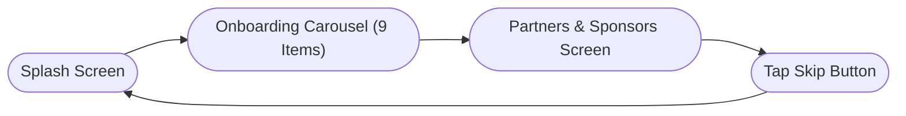

# MyPledge User Flows

This page documents the various user flows in the **MyPledge** app. Each flow is represented as a flowchart, and important notes are provided using admonitions.

## Table of Contents

- [User Setup Related Flows](#user-setup-related-flows)
  - [Guest Flow](#guest-flow)
  - [Sign Up Flow](#sign-up-flow)
  - [Log In Flow](#log-in-flow)
  - [Reset Password Flow](#reset-password-flow)
  - [Returning User Flow](#returning-user-flow)
- [Homescreen Related Flows](#homescreen-related-flows)
- [Goals Flows](#goals-flows)
- [Saving Plans Flows](#saving-plans-flows)
- [Profile Flows](#profile-flows)

## User Setup Related Flows

### Introduction

A new user is greeted by both the **Launch Screen** and the **Splash Screen**. The splash screen displays three buttons:
- **Log In**
- **Register**
- **Continue as Guest**

Each button leads to a different flow. Below are the detailed flows.

### Guest Flow

!!! note "Note"
    The individual list components holding the sponsors, when tapped, link to external websites of these sponsors.

### Sign Up Flow

!!! note "Note"
    The onboarding carousel is scrollable by the user (swipe left/right) instead of only using buttons.

### Adding Earning Frequency (Post Sign-Up)

At the end of the onboarding carousel in the sign up flow, users are directed to add their earning frequency.

### Log In Flow

### Reset Password Flow

### Returning User Flow

## Homescreen Related Flows

*Documentation coming soon…*

## Goals Flows

*Documentation coming soon…*

## Saving Plans Flows

*Documentation coming soon…*

## Profile Flows

*Documentation coming soon…*
